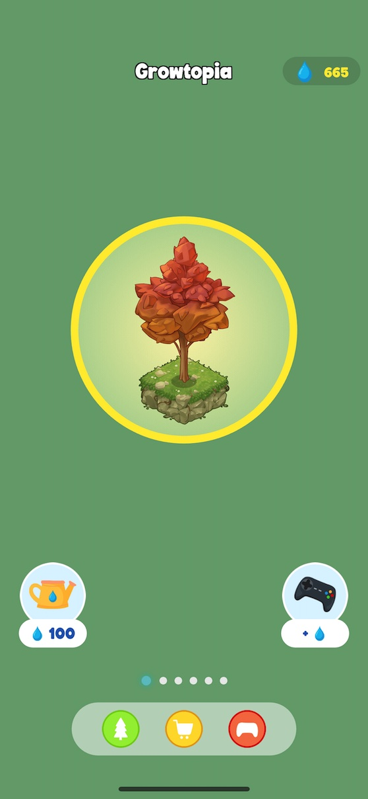
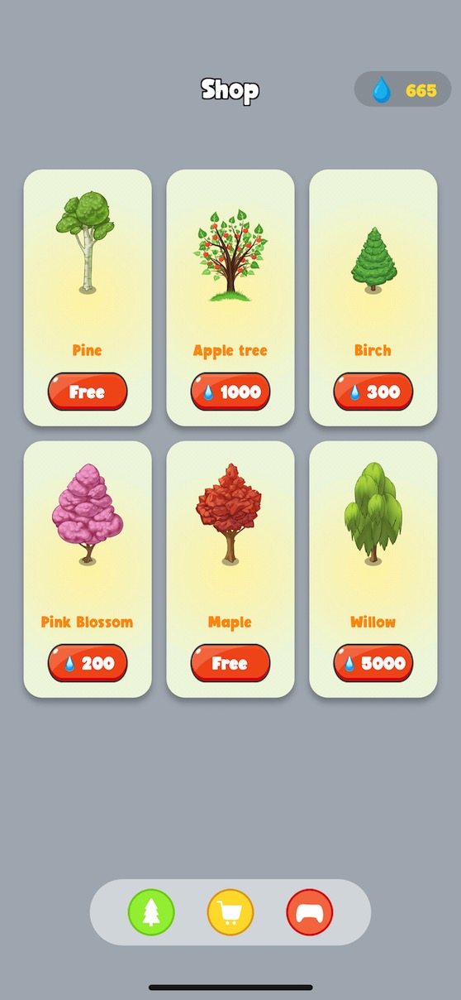
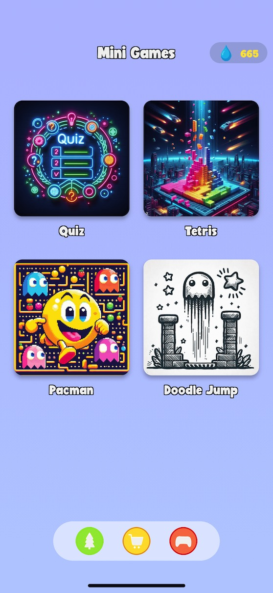
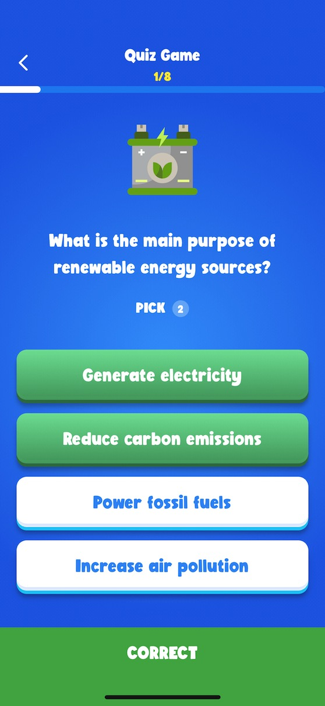
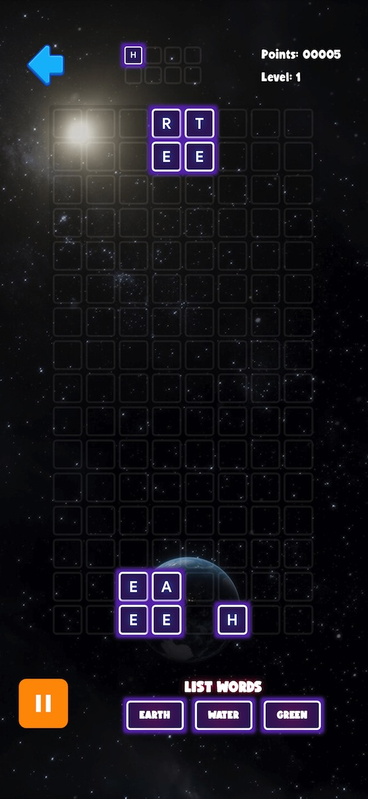

# Growtopia - Grow your forest

## License

This project is under BSD-3-Clause License. Please read the LICENSE.md file for more detail.

## Inspiration

- Our team's dedication to environmental conservation and tree planting has been the driving force behind our game development.
- We took cues from Forestapp's mix of gaming and tree planting to create games that promote eco-awareness and good habits.
- Inspired by Lumosity, we love the concept of a main goal, and then the user can develop it by playing multiple mini-games.
- Our goal is simple: entertain players while encouraging a love for nature and boosting mental skills.

  Read more at [About](ABOUT.md)

## About this project

This is the project of our app Growtopia, apply for [Global Gamers Challenge](https://globalgamers.devpost.com/)

Idea of the app is allow the user to plant trees. Trees can be various like Maple, Pink Blossom, Willow... and can be grown by watering them.
The user can play mini-games such as Quizzes, Word Tetris, Doodle Jump to earn water drops. The users also can watch reward ads to double their water drops.
When the tree is grown to max level, the user can collect collectibe cards and save it to his/her Google Wallet.
Every progresses of the game are saved to the cloud using Backend buit by Supabase

## Tech stack

- Flutter
- Flame
- Supabase (Backend as service)
- Various AIs to generate game assets such as ChatGPT, Bing Image Creation, Leonardo AI...

## Run the app

- Clone this repo, build and run as common Flutter project

## Demo

[https://growtopia-a4a53.web.app/](https://growtopia-a4a53.web.app/)

## Screenshots

# Gen app icon:

`flutter pub run flutter_launcher_icons`
